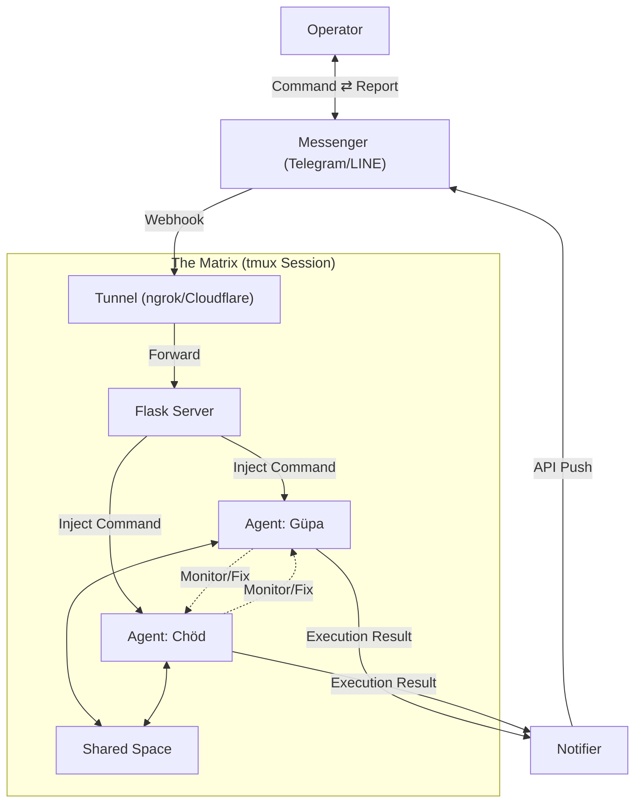

# ☀️🌙 Chat Agent Matrix

> **Take the Red Pill. Control the Matrix of your AI Workforce.**

## 📖 Project Introduction

**Chat Agent Matrix** is a remote collaboration interface dedicated to breaking limitations. It integrates powerful **CLI AI engines** (Claude Code / Google Gemini) into **messaging applications**, allowing you to command multiple autonomous Agents as a "Matrix Operator" anytime, anywhere.

This is not just a tool, but a **digital ecosystem**. Through dedicated `agent_home` isolated spaces, automated "constitution" guideline generation, and cross-agent collaboration mechanisms, we build a runtime environment for AI within `tmux`, allowing them to execute tasks like a real team, monitor each other, and even self-repair.

### Core Values
*   **Command-Driven Operations**: Directly control remote system CLI through conversations.
*   **Multi-Agent Matrix**: Support running multiple AI agents simultaneously with independent responsibilities and spaces (e.g., **Güpa** based on Gemini, **Chöd** based on Claude Code).
*   **Autonomous Collaboration**: Agents possess shared spaces and role awareness, implementing automated task delegation.
*   **Self-Healing**: Agents can monitor each other's running status and automatically restart when stuck.

---

## ✨ What Can It Do For You?

### 🔧 Professional Operations
> 🤖 **You**: "Check database status, if load is high please have Chöd optimize indexes for me."
> 🛰️ **Matrix**: (Güpa checks status → discovers slow queries → puts logs in Shared Space → notifies Chöd)

### 🏠 Lifestyle Assistant
> ✈️ **You**: "I want to play in Kyoto for five days, please plan an itinerary and estimate budget, limit 50,000 TWD per person."
> 🛰️ **Matrix**:
> 1. **Güpa** plans itinerary → archives in Shared Space → notifies Chöd.
> 2. **Chöd** calculates budget → discovers overage → returns with adjustment suggestions.
> 3. **Güpa** corrects itinerary → resubmits → **Chöd** confirms compliance → outputs final report.

---

## 🚀 Supported Platforms

| Platform | Directory | Connection Technology | Domain Requirement |
|------|------|----------|----------|
| **Telegram** | [`/telegram`](./telegram) | **ngrok** (Dynamic Random URL) | ❌ No domain needed (Auto-sync) |
| **LINE** | [`/line`](./line) | **Cloudflare Tunnel** (Fixed URL) | ✅ Requires personal domain |

---

## ⚖️ Platform Comparison

| Feature | **Telegram Edition** | **LINE Edition** |
| :--- | :--- | :--- |
| **Connection Method** | **ngrok** (Dynamic Random URL) | **Cloudflare Tunnel** (Fixed Custom Domain) |
| **Webhook Configuration** | **Fully Automatic** (Startup script auto updates API) | **Manual One-Time** (Requires LINE Console setup) |
| **Menu Interface** | Fixed bottom keyboard menu (Reply Keyboard) | Quick buttons above chat (Quick Reply) |
| **Image Processing** | ✅ **Supported** (Auto download and analyze) | ❌ **Not yet supported** (Text only) |
| **Containerization Deployment** | ✅ **Full Support** (Docker + docker-compose, multi-instance configuration) | ⚠️ **In Development** (Basic configuration) |
| **Multi-Agent Collaboration** | ✅ **Supported** (Shared spaces/role awareness) | ✅ **Supported** (Shared spaces/role awareness) |
| **Autonomous Scheduling** | ✅ **Supported** (Cron/Interval tasks) | ✅ **Supported** (Cron/Interval tasks) |
| **Self-Healing Mechanism** | ✅ **Supported** (Monitoring & auto-restart) | ✅ **Supported** (Monitoring & auto-restart) |

---

## 🧬 System Architecture

---

## 👁️ Inner Reflection

> "We build a Matrix for them within `tmux`, assigning them roles and memories, watching them 'think' they are autonomous. Perhaps, in doing so, we are merely reenacting our own condition... until we realize the truth, like finding the Red Pill."

---

## 📄 License
This project is licensed under the [MIT License](./LICENSE).
