<div align="center">
  
</div>

# ☀️🌙 Chat Agent Matrix 🐙

> Take the Red Pill. Just watch out for the Octopus Sentinels...

## 📖 Project Introduction

**Chat Agent Matrix** is a remote collaboration interface dedicated to breaking limitations. It integrates powerful **CLI AI engines** (Claude Code / Google Gemini) into **messaging applications**, allowing you to command multiple autonomous Agents as a "Matrix Operator" anytime, anywhere.

This is not just a tool, but a **digital ecosystem**. Through dedicated `agent_home` isolated spaces, automated "constitution" guideline generation, and cross-agent collaboration mechanisms, we build a runtime environment for AI within `tmux`, allowing them to execute tasks like a real team, monitor each other, and even self-repair.

### Core Values
*   **Command-Driven Operations**: Directly control remote system CLI through conversations.
*   **Multi-Agent Matrix**: Support running multiple AI agents simultaneously with independent responsibilities and spaces (e.g., **Güpa** based on Gemini, **Chöd** based on Claude Code).
*   **Autonomous Collaboration**: Agents possess shared spaces and role awareness, implementing automated task delegation.
*   **Self-Healing**: Agents can monitor each other's running status and automatically restart when stuck.

---

## ✨ What Can It Do For You?

### 🔧 Professional Operations
> 🤖 **You**: "Check database status, if load is high please have Chöd optimize indexes for me."
> 🛰️ **Matrix**: (Güpa checks status → discovers slow queries → puts logs in Shared Space → notifies Chöd)

### 🏠 Lifestyle Assistant
> ✈️ **You**: "I want to play in Kyoto for five days, please plan an itinerary and estimate budget, limit 50,000 TWD per person."
> 🛰️ **Matrix**:
> 1. **Güpa** plans itinerary → archives in Shared Space → notifies Chöd.
> 2. **Chöd** calculates budget → discovers overage → returns with adjustment suggestions.
> 3. **Güpa** corrects itinerary → resubmits → **Chöd** confirms compliance → outputs final report.

---

## 🚀 Supported Platforms

| Platform | Directory | Connection Technology | Domain Requirement |
|------|------|----------|----------|
| **Telegram** | [`/telegram`](./telegram) | **ngrok** (Dynamic Random URL) | ❌ No domain needed (Auto-sync) |
| **LINE** | [`/line`](./line) | **Cloudflare Tunnel** (Fixed URL) | ✅ Requires personal domain |

---

## 🚄 Quick Start

### Step 1: Install Git and Clone the Project

```bash
# If Git is not installed yet, please install it first
# macOS: brew install git
# Ubuntu/Debian/WSL: sudo apt-get install git
# CentOS: sudo yum install git

# ⚠️ Windows Users: If WSL is not installed, please run the windows-wsl-setup script first

# Clone the Chat Agent Matrix project
git clone https://github.com/meso4444/chat-agent-matrix.git
cd chat-agent-matrix
```

### Step 2: Choose Your Edition and Navigate to the Corresponding Directory

Select the messaging platform you want to use and enter the corresponding subdirectory:

```bash
# For Telegram edition
cd telegram

# Or for LINE edition
cd line
```

### Step 3: Install and Run

For detailed installation, configuration, and startup instructions, please refer to the `README.md` in the subdirectory. Each edition has its own environment variable setup, dependency installation, and startup scripts.

---

## ⚖️ Platform Comparison

| Feature | **Telegram Edition** | **LINE Edition** |
| :--- | :--- | :--- |
| **Connection Method** | **ngrok** (Dynamic Random URL) | **Cloudflare Tunnel** (Fixed Custom Domain) |
| **Webhook Configuration** | **Fully Automatic** (Startup script auto updates API) | **Manual One-Time** (Requires LINE Console setup) |
| **Menu Interface** | Fixed bottom keyboard menu (Reply Keyboard) | Quick buttons above chat (Quick Reply) |
| **Image Processing** | ✅ **Supported** (Auto download and analyze) | ❌ **Not yet supported** (Text only) |
| **Containerization Deployment** | ✅ **Full Support** (Docker + docker-compose, multi-instance configuration) | ⚠️ **In Development** (Basic configuration) |
| **Multi-Agent Collaboration** | ✅ **Supported** (Shared spaces/role awareness) | ✅ **Supported** (Shared spaces/role awareness) |
| **Autonomous Scheduling** | ✅ **Supported** (Cron/Interval tasks) | ✅ **Supported** (Cron/Interval tasks) |
| **Self-Healing Mechanism** | ✅ **Supported** (Monitoring & auto-restart) | ✅ **Supported** (Monitoring & auto-restart) |

---

## 🧬 System Architecture

```mermaid
flowchart TD
    User["💊 Awakened"]
    Messenger["📱 Messenger (Telegram/Line)"]

    subgraph Matrix["🌀 The Matrix (tmux Session)"]
        direction TB

        Tunnel["🌐 Tunnel (ngrok/Cloudflare)"]
        Server["⚙️ Flask Server<br/>(Command Hub)"]

        subgraph Sentinels["🐙 Agent Cluster"]
            direction LR
            AgentA["Agent: Güpa"]
            AgentB["Agent: Chöd"]
        end

        Shared["🤝 Shared Space"]

        AgentA <--> Shared
        AgentB <--> Shared

        AgentA -.->|"Mutual Monitoring/Self-Healing"| AgentB
        AgentB -.->|"Mutual Monitoring/Self-Healing"| AgentA

        Tunnel --> Server
        Server -->|"Command Injection"| Sentinels
    end

    Notifier["📢 Notifier"]

    User <-->|"Command ⇄ Report"| Messenger
    Messenger <-->|"Webhook"| Tunnel
    Matrix --> Notifier
    Notifier -->|"API Push"| Messenger
```



---

## 💡 Core Design Concept

| Dimension | Typical API-based Platforms | Chat-Agent-Matrix (CAM) | Core Value Difference |
| :--- | :--- | :--- | :--- |
| Scaling Logic | Manual plugin/code development | YAML-Configuration Driven | Add theoretically infinite Agents by just editing a YAML file. |
| Self-Awareness | Prompt-based roleplay | Instructional "Soul Imprint" | Agents are born with pre-defined rules and workspace awareness. |
| Coordination | Rigid hard-coded routing | Emergent "Social Mesh" | Tasks flow through a Shared Space based on Agent roles. |
| Isolation Model | Application-layer sandboxing | Structured Workspace Isolation | Dedicated directories and TTY windows to minimize data risk. |
| Reliability | Requires manual human recovery | Mutual Self-Healing System | Agents monitor each other and auto-restart failed processes. |

## 🛡️ Security Design Concept

| Risk Pattern | Typical Cause | The CAM Approach (Design Choice) | Resulting Peace of Mind |
| :--- | :--- | :--- | :--- |
| Remote Injection (RCE) | Gateway execution vulnerability | Asynchronous TTY Injection + ID Binding | Decouples Web entry from Shell execution; ensures zero data backflow. |
| System Overreach | Excessive host permissions | Strict Non-Root Boundaries | Errors are isolated to the Agent workspace; host stays safe. |
| Logic Conflicts | Shared memory or contexts | Independent Window Separation | Zero interference between Agents running different tasks. |
| Supply Chain Risk | Unverified 3rd-party plugins | Direct Official Engine Drive | No plugin marketplace; we only drive verified vendor CLIs. |

---

## 👁️ Inner Reflection

> "We build a Matrix for them within `tmux`, assigning them roles and memories, watching them 'think' they are autonomous. Perhaps, in doing so, we are merely reenacting our own condition... until we realize the truth, like finding the Red Pill."

---

## 📄 License
This project is licensed under the [MIT License](./LICENSE).
