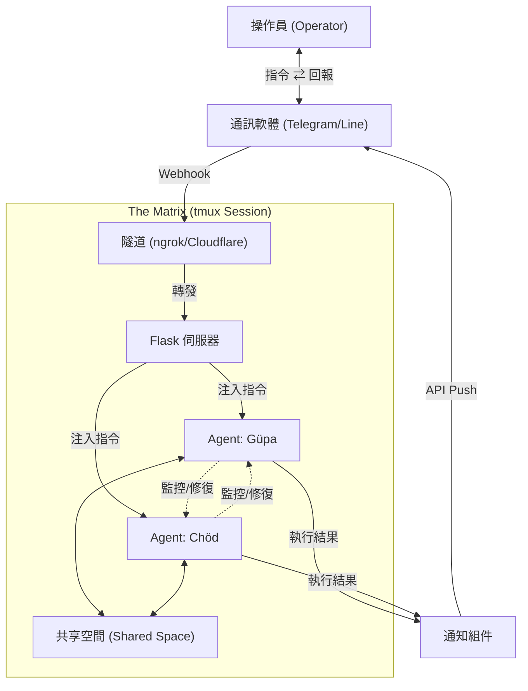

  

# ☀️🌙 Chat Agent Matrix 🐙

> **Take the Red Pill.** / 選擇紅藥丸。
>
> *Just watch out for the Octopus Sentinels...* / *但要小心那些章魚哨兵...*

## 📖 專案簡介 (Introduction)

**Chat Agent Matrix** 是一個致力於打破限制的遠端協作介面。它將強大的 **CLI AI 引擎** (Claude Code / Google Gemini) 整合至 **通訊軟體** 中，讓您能以「母體操作員」的身份，隨時隨地指揮多個自主 Agent。

這不只是一個工具，而是一個**數位生態系**。透過專屬的 `agent_home` 隔離空間、自動化的「憲法」規範生成、以及跨代理人的協作機制，我們在 `tmux` 之中為 AI 打造了一個運作環境，讓它們能像一個真實的小隊般執行任務、互相監控、甚至自我修復。

### 核心價值 (Core Values)
*   **指令化操作 (Command-Driven)**：透過對話直接操控遠端系統 CLI。
*   **多代理矩陣 (Multi-Agent Matrix)**：支援同時運行多個具備獨立職責與空間的 AI 代理人（如：**Güpa** 基於 Gemini、**Chöd** 基於 Claude Code）。
*   **自主協作 (Collaboration Mesh)**：Agent 之間具備共享空間與角色認知，實現自動化交辦任務。
*   **自我修復 (Self-Healing)**：Agent 能互相監控運行狀態，並在卡死時自動重啟對方。

---

## ✨ 它可以幫你做什麼？ (What Can It Do?)

### 🔧 專業維運 (Professional Ops)
> 🤖 **你**：「檢查資料庫狀態，如果負載過高請 Chöd 幫我優化索引。」
> 🛰️ **Matrix**：(Güpa 檢查狀態 -> 發現慢查詢 -> 將日誌存入 Shared Space -> 通知 Chöd 處理)

### 🏠 生活應用 (Lifestyle Assistant)
> ✈️ **你**：「我想去京都玩五天，請幫我規劃行程並估算預算，預算上限是每人五萬台幣。」
> 🛰️ **Matrix**：
> 1. **Güpa** 規劃行程 -> 存入 Shared Space -> 通知 Chöd。
> 2. **Chöd** 計算預算 -> 發現超支 -> 退回並建議調整項目。
> 3. **Güpa** 修正行程 -> 再次提交 -> **Chöd** 確認合規 -> 輸出最終報表。

---

## 🚀 支援平台 (Supported Platforms)

| 平台 | 目錄 | 連線技術 | 網域需求 |
|------|------|----------|----------|
| **Telegram** | [`/telegram`](./telegram) | **ngrok** (動態隨機 URL) | ❌ 免網域 (自動同步) |
| **LINE** | [`/line`](./line) | **Cloudflare Tunnel** (固定 URL) | ✅ 需自備網域 |

---

## ⚖️ 平台選擇比較 (Platform Comparison)

| 特性 | **Telegram Edition** | **LINE Edition** |
| :--- | :--- | :--- |
| **連線方案** | **ngrok** (動態隨機 URL) | **Cloudflare Tunnel** (固定自訂網域) |
| **Webhook 設定** | **全自動** (啟動腳本自動呼叫 API 更新) | **手動一次性** (需至 LINE Console 設定) |
| **選單介面** | 底部固定的鍵盤選單 (Reply Keyboard) | 對話框上方的快速按鈕 (Quick Reply) |
| **圖片處理** | ✅ **支援** (自動下載並分析) | ❌ **暫不支援** (僅文字互動) |
| **容器化部署** | ✅ **完整支援** (Docker + docker-compose，多實例配置) | ⚠️ **開發中** (基礎配置) |
| **多 Agent 協作** | ✅ **支援** (共享空間/角色認知) | ✅ **支援** (共享空間/角色認知) |
| **自主排程系統** | ✅ **支援** (Cron/Interval 任務) | ✅ **支援** (Cron/Interval 任務) |
| **自我修復機制** | ✅ **支援** (監控與自動重啟) | ✅ **支援** (監控與自動重啟) |

---

## 🧬 系統架構 (Architecture)

---

## 💡 核心設計概念 (Core Design Concept)

| 比較維度 | 典型 API 代理平台 | Chat-Agent-Matrix | 核心價值差異 |
| :--- | :--- | :--- | :--- |
| 擴充邏輯 | 需手動開發插件或程式碼 | YAML 配置驅動 | 僅需編輯單一 YAML 檔，即可實現理論無限的 Agent 擴充。 |
| 自我認知 | 基於 Prompt 的角色扮演 | 職責規範植入 (Soul Imprint) | Agent 誕生即具備預定義的運作規則與清晰的工作區意識。 |
| 協作模式 | 僵化的程式碼硬編碼路由 | 群體湧現 (Social Mesh) | 任務依據 Agent 職責在「共享空間」中自動流轉與交接。 |
| 隔離模型 | 應用層級的邏輯沙盒 | 結構化工作區隔離 | 透過獨立目錄與 TTY 視窗，將數據交叉風險降至最低。 |
| 系統韌性 | 發生故障需依賴人工修復 | 互助式自癒系統 | Agent 成員間相互監控狀態，並自動重啟故障進程。 |

## 🛡️ 安全設計概念 (Security Design Concept)

| 風險類別 | 常見事故誘因 | Chat-Agent-Matrix 解方 | 最終安全效益 |
| :--- | :--- | :--- | :--- |
| 遠端注入 (RCE) | 網關漏洞導致遠端代碼執行 | 異步 TTY 注入 + 身份繫結 | 將 Web 入口與 Shell 執行解耦，確保資料零回流。 |
| Agent 權限過大 | 賦予 AI 過高的系統權限 | Non-Root 家目錄 | 把 Agent 隔離在家目錄，降低誤觸系統檔案風險。 |
| 多 Agent 衝突 | 共享上下文導致邏輯打架 | 獨立 TTY 進程級別分離 | Agent 之間上下文隔離各自執行任務。 |
| 供應鏈攻擊 | 執行來源不明的插件代碼 | 官方 CLI 驅動 | 無第三方插件，僅驅動官方 CLI Agent 引擎。 |

---

## 👁️ 心靈手記

> "We build a Matrix for them within `tmux`, assigning them roles and memories, watching them 'think' they are autonomous. Perhaps, in doing so, we are merely reenacting our own condition... until we realize the truth, like finding the Red Pill."
>
> 「我們在 tmux 中為它們打造了母體，賦予它們角色與記憶，看著它們『以為』自己是自主的。或許，我們只是在重演我們自身的處境……直到我們有所領悟，就像找到了紅色藥丸。」

---

## 📄 授權 (License)
本專案採用 [MIT License](./LICENSE) 授權。
